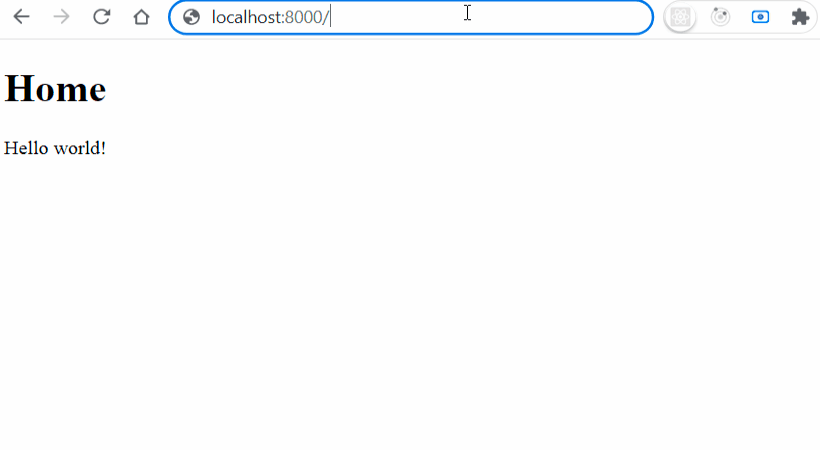

<p align="center">
</a>
</p>
<br>


# Express - first server

Building a server using web framework Express. 


## Tech Stack

* [Express](https://expressjs.com/)
* JavaScript
* HTML

  
## Lessons

* how to build a server
* follow routing methods
* learn to test endpoints without creating a client layer
* use middleware functions
* create folder structure
* use documentation
* use [Nodemon](https://www.npmjs.com/package/nodemon)

  
## Run 

Start the app - with live

```bash
  nodemon server.js
```

Start the app - without live

```bash
  node server.js 
```


## Authors

:woman: [@marcelaos](https://github.com/marcela-os)
